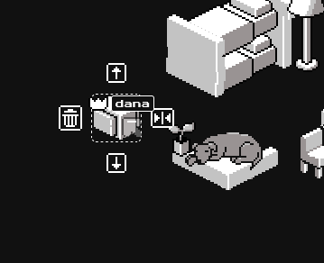

# iamafk
  

is your cursor tired of clicking all day? this is a place for your cursor to rest .

## hat and furniture gachapon machine .

## afk leaderboards .

## build a house .

## afk with friends .

## documentation .

[Full process is on my blog](https://digi.dana.nyc/blog/cursor-hotel)

[7 days of user activity diary](https://digi.dana.nyc/blog/cursor-diary)

## thank you .

thank you mshj, rox, tim .

coded with cursor, chatgpt, and claude .

**i do not support ai taking roles of developers, programmers, or engineerings . this is a passion project which i would not have been able to do otherwise without these tools . i would also not have been able to do this without my friends who reviewed my code and gave me advice .**
